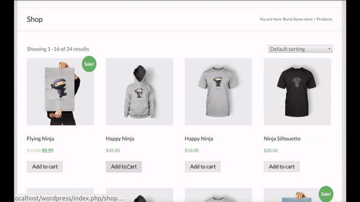

# WooCommerce (WordPress) BURST payments - wc-burst

There are many alternatives for cryptocurrency payments these days.
However, the way they are implemented hurt many important principles:
you need to create an account, manage API keys, they hold your funds, etc.
Actually, most systems are more alike exchanges or classical credit card payment companies
than anything else.

This project consists in a simple and powerful checkout solution for [WooCommerce](https://woocommerce.com)
to receive in [BURST](https://www.burst-coin.org/) with **zero additional fees**.
**No registration is required**, you just need a Burst wallet address.
**No charge back**, blockchain operations are irreversible and immutable.
There is also an option for **instant payments**, recommended for small payments (e.g. a cup of coffee) with a small risk
(accepting unconfirmed transactions).

[WooCommerce](https://woocommerce.com) claims to have more than 70 million downloads and to power over 28% of all online stores.
It is probably one of the most used e-commerce platforms.

In the video below this WooCommerce BURST payment system is explained in more details, including how to use it
as well as how to configure it.

Payment values are converted from your configured FIAT currency to BURST using [Coingecko](https://www.coingecko.com/) API.
Buyers should transfer BURST directly to your Burst address: your wallet, your funds.
There is no third party holding your funds.

Different payment options are shown to the buyer (QR code, link, or address to transfer BURST) in the checkout page.
You can configure the plugin to accept instant payments (accepting unconfirmed transactions).
The number of confirmations (blocks) to accept general payments is also configurable.

The system works as follows. When a buyer select to pay in BURST, the order is set as on-hold and the user is asked
to transfer a given BURST amount to the store address.
A background service is scheduled to check for these on-hold payments every 30 seconds.
If the payment is found on Burst blockchain (and has already the number of confirmations) the order is set as paid.
Unpaid orders are cancelled after a specified number of minutes, also by the same background service.

## FIAT Currencies supported

The limitation is actually the [Coingecko](https://www.coingecko.com/) API.
Currently the following currencies are supported:
                'USD', 'AED', 'ARS', 'AUD', 'BDT', 'BHD', 'BMD', 'BRL', 'CAD', 'CHF','CLP', 'CNY', 'CZK', 'DKK', 'EUR', 'GBP',
                'HKD', 'HUF', 'IDR', 'ILS', 'INR', 'JPY', 'KRW', 'KWD', 'LKR', 'MMK', 'MXN', 'MYR', 'NOK', 'NZD', 'PHP', 'PKR',
                'PLN', 'RUB', 'SAR', 'SEK', 'SGD', 'THB', 'TRY', 'TWD', 'UAH', 'VEF', 'VND', 'ZAR', 'XDR', 'XAG', 'XAU'

Recalling that this plugin converts the order total amount from your FIAT currency to BURST.
Then the buyer transfer to your Burst wallet this BURST amount.

## Installation

Download (or clone) this repository.
Then move the contents to your WordPress plugins folder `wp-content/plugins`.
Finally, enable the plugin and configure the parameters using your WordPress admin page.

### Requirements

Tested with WordPress 5.5.2 and WooCommerce 3.6.5.

## License

This code is licensed under [GPLv3](LICENSE).
This project also includes code from the [PHP QR Code library](http://phpqrcode.sourceforge.net/).

## Author

jjos

Donation address: BURST-JJQS-MMA4-GHB4-4ZNZU
